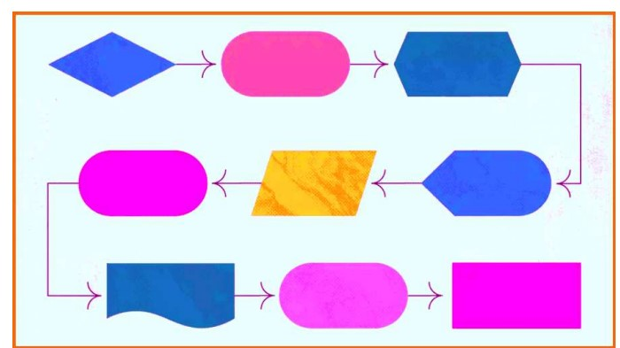

# RA6_Angel
# Documentacion de aplicacion veterinaria
***
## Indice


* Documentacion de aplicacion veterinaria
   * [Indice](##Indice)
   * [Introduccion](##Introduccion)
   * [uso](uso)
   * [instalacion](subvencion)


## Introduccion

El sitema de gestio loren ipsun loren ipsun loren ipsin **IES miguel herrero pereda**

## Instalacion 
Para instalar local
1. Clona repositorio 

```bash git clone https://...```


2. abre el proyecto


3. compila y ejecuta el proyecto

## Uso


El sitema de veterinario incluye lo siguiente 

+ solicitud gestio
+ acceso y consulta
+ comunicacion entre opacientes
+ administracion del personal 
+ revision de informes
+ gestion de facturas


Para utiizar la aplicacion

|**Usuario**    | **funcionalidad**|
|   -------        |     ----------   |
|Paciente  | solicita citas,accede a su historial,contacta medico|
|veterianrio  | solicita citas,accede a su historial,contacta medico
|administracion  | solicita citas,accede a su historial,contacta medico|


Lo representamos a traves del siguiente diagrama 





## Contribucion


¿quieres colaborar?


   1. Haz un clone del repositorio
   2. crea una nueva rama(`git checkout -b feature`)
   3. crea una nueva rama(`git checkout -b feature`)
   4. crea una nueva rama(`git checkout -b feature`)
   5. abre pull request

## Subvencion

Este proyecto esta subencionado por el [Gobierno de España](https://www.infosubvenciones.es/bdnstrans/GE/es/inicio)
***


